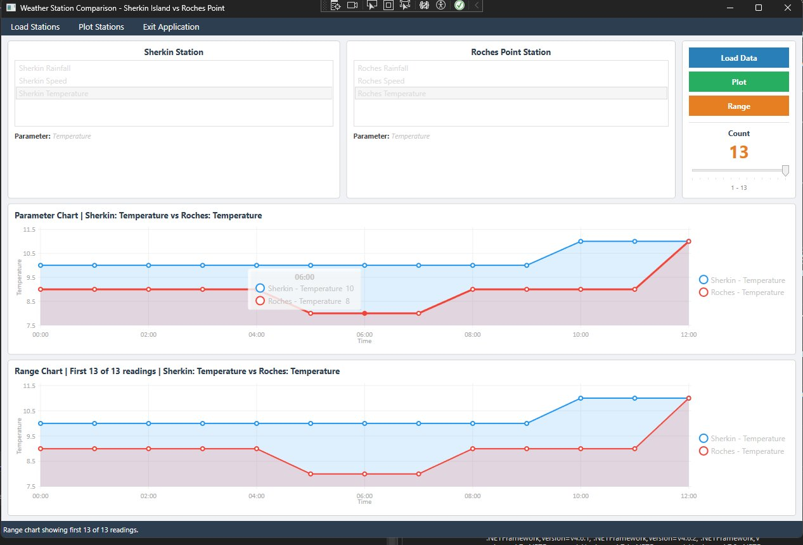
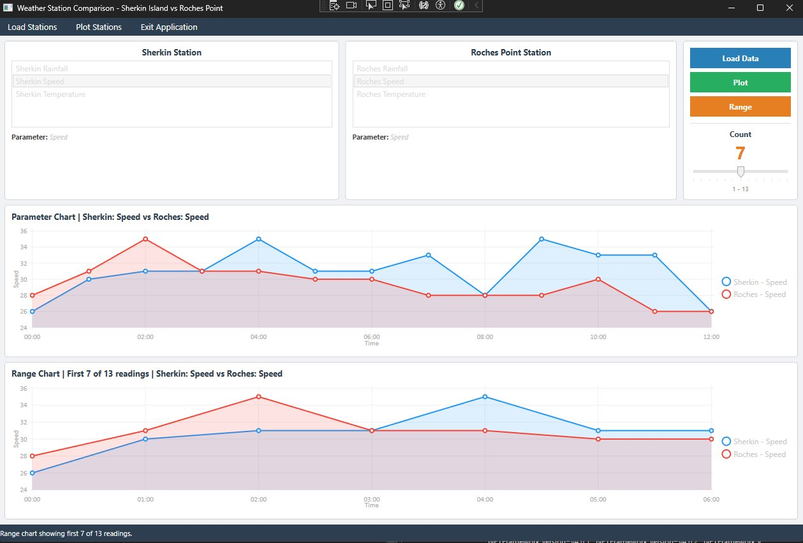

# Interface Development — Weather Station Monitor

**Module:** Interface Software Development | **Variant:** 16  
**Author:** Alan O'Connell | **Student No:** R00243626  
**Institution:** Munster Technological University

A WPF desktop app in C# that reads and compares weather data from two Met Éireann stations — Sherkin Island and Roches Point — and plots temperature, wind speed, and rainfall on interactive charts using LiveCharts.

## Current status

The core functionality is working: data loading, parameter selection, and plotting both stations on a chart. The slider/range feature and differences file are still in progress. See the [progress report](docs/) for details.

## Screenshots


*Temperature comparison — both stations plotted*


*Wind Speed comparison with Range chart at Count = 8*

## What it does

- **Load Data** scans the `SherkinWeatherData` and `RochesWeatherData` folders and fills two ListBoxes with the available parameters (Temperature, Speed, Rainfall). Time files are excluded.
- - **Double-clicking** a parameter in a ListBox reads the corresponding `.txt` file and pairs each time value with the parameter reading into a `SortedDictionary<DateTime, double>`.
  - - **Plot** draws both station datasets as separate `LineSeries` on a LiveCharts `CartesianChart`, with time on the X-axis.
    - - A **Slider** (acting as the potentiometer) adjusts a Count value from 1 to the total number of data points.
      - - **Range** plots a subset of the data based on the current Count value on a second chart.
        - - A **differences file** writes the per-timestamp difference between the two stations to a `.txt` file.
          - - **Menu bar** has Load Stations, Plot Stations, and Exit Application options.
           
            - ## Technologies
           
            - | | |
            - |---|---|
            - | Language | C# / .NET 8 |
            - | UI | WPF |
            - | Charting | LiveCharts.Wpf 0.9.7 |
            - | Data storage | `SortedDictionary<DateTime, double>` |
            - | File I/O | `StreamReader`, `StreamWriter`, `Directory.GetFiles` |
            - | IDE | Visual Studio 2022 |
            - | Data | Met Éireann open observations |
           
            - ## Project structure
           
            - ```
              Interface-Dev-Weather-Monitor/
              ├── WeatherStationApp/
              │   ├── MainWindow.xaml
              │   ├── MainWindow.xaml.cs
              │   ├── App.xaml / App.xaml.cs
              │   ├── WeatherStationApp.csproj
              │   ├── SherkinWeatherData/
              │   │   ├── Sherkin Temperature.txt
              │   │   ├── Sherkin Speed.txt
              │   │   ├── Sherkin Rainfall.txt
              │   │   └── Sherkin Time.txt
              │   └── RochesWeatherData/
              │       ├── Roches Temperature.txt
              │       ├── Roches Speed.txt
              │       ├── Roches Rainfall.txt
              │       └── Roches Time.txt
              ├── Versions/                  # older builds
              ├── docs/
              │   ├── progress-report.docx
              │   ├── sherkin-island.csv
              │   ├── roches-point.csv
              │   └── screenshots/
              └── README.md
              ```

              ## Running it

              ```bash
              git clone https://github.com/Alan64578/Interface-Dev-Weather-Monitor.git
              ```

              1. Open `WeatherStationApp/WeatherStationApp.slnx` in Visual Studio 2022
              2. 2. Make sure `LiveCharts.Wpf` 0.9.7 is installed via NuGet
                 3. 3. Build and run (F5)
                    4. 4. The `SherkinWeatherData` and `RochesWeatherData` folders need to be in the output directory alongside the executable
                      
                       5. ## Data source
                      
                       6. - [Sherkin Island observations](https://www.met.ie/latest-reports/observations/download/sherkin-island)
                          - - [Roches Point observations](https://www.met.ie/latest-reports/observations/download/roches-point)
                           
                            - ## Note
                           
                            - AI tools were used to help format this README. All project code was written by the author.
